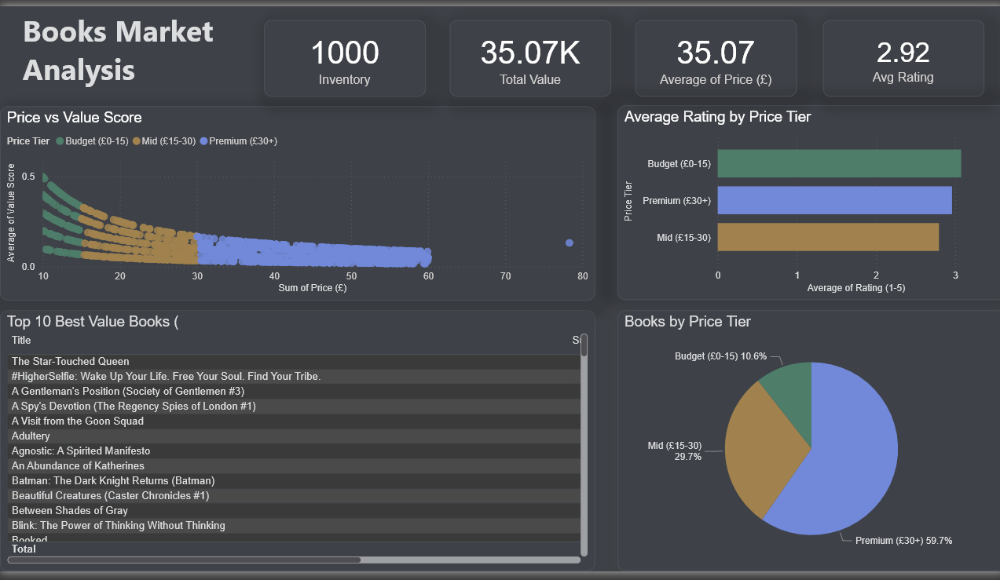

# Books Market Analysis — Web Scraping & Data Pipeline

I built this project to practice end-to-end data work — from scraping a live website all the way to a formatted Excel report and Power BI dashboard. It's one of those projects where you realize halfway through how messy real data actually is.

## What it does

Scrapes all 1000 books from [books.toscrape.com](https://books.toscrape.com), cleans the messy raw data, runs SQL analysis on it, and delivers a formatted Excel report with 4 sheets — all from a single Python script.

## The problem with the raw data

When you first pull the data off the site it's not clean at all. Prices come out looking like `£51.77` instead of `51.77` (encoding issue from the HTML), ratings are words like "Three" instead of numbers, and the availability field has random whitespace around it. I documented every issue I found and fixed them one by one.

**Issues fixed:**
- Currency encoding artifact `£` stripped from all prices
- Prices converted from string to float
- Missing prices filled with median value
- Text ratings (`"Three"`) mapped to integers (`3`)
- Availability normalized to boolean (True/False)
- Duplicate rows detected and removed
- Derived `value_score` column (rating ÷ price) as a business metric
- Derived `price_tier` column (Budget / Mid / Premium) for segmentation

## Pipeline steps

```
books.toscrape.com
       ↓
  requests + BeautifulSoup  →  raw data (messy)
       ↓
      pandas                →  clean data
       ↓
      SQLite                →  3 analytical queries
       ↓
     openpyxl               →  formatted Excel report (4 sheets)
       ↓
      Power BI              →  interactive dashboard
```

## What's in the Excel report

| Sheet | Contents |
|---|---|
| Dashboard | KPI summary + Price Tier table + Top 5 Value Books |
| Clean Data | All 1000 books with cleaned columns |
| SQL Results | Output of 3 analytical SQL queries |
| Pipeline Log | Every data issue found and how it was fixed |

## SQL queries included

```sql
-- Which books give you the most rating per pound?
SELECT title, price_gbp, rating, value_score
FROM books ORDER BY value_score DESC LIMIT 5

-- Do cheaper books actually get better ratings?
SELECT price_tier, COUNT(*), ROUND(AVG(price_gbp),2), ROUND(AVG(rating),2)
FROM books GROUP BY price_tier ORDER BY avg_price

-- Stock breakdown
SELECT in_stock, COUNT(*), ROUND(AVG(price_gbp),2)
FROM books GROUP BY in_stock
```

## Key finding

Budget books (under £15) have an average value score of **0.22** compared to **0.07** for Premium books (£30+). Price and rating are almost completely uncorrelated — expensive books don't get better ratings, they just cost more.

## Tools used

- **Python 3** — main language
- **requests** — fetching pages
- **BeautifulSoup** — parsing HTML
- **pandas** — data cleaning and transformation
- **sqlite3** — SQL database
- **openpyxl** — Excel formatting
- **Power BI** — dashboard

## How to run it

```bash
pip install requests beautifulsoup4 pandas openpyxl
python scraping_pipeline.py
```

The script will scrape all 50 pages automatically and stop when it hits the last one. Output files (`books_portfolio_project.xlsx` and `books.db`) will appear in the same folder.

---

*Built by Youssef — Data Analyst / Data Engineer*
